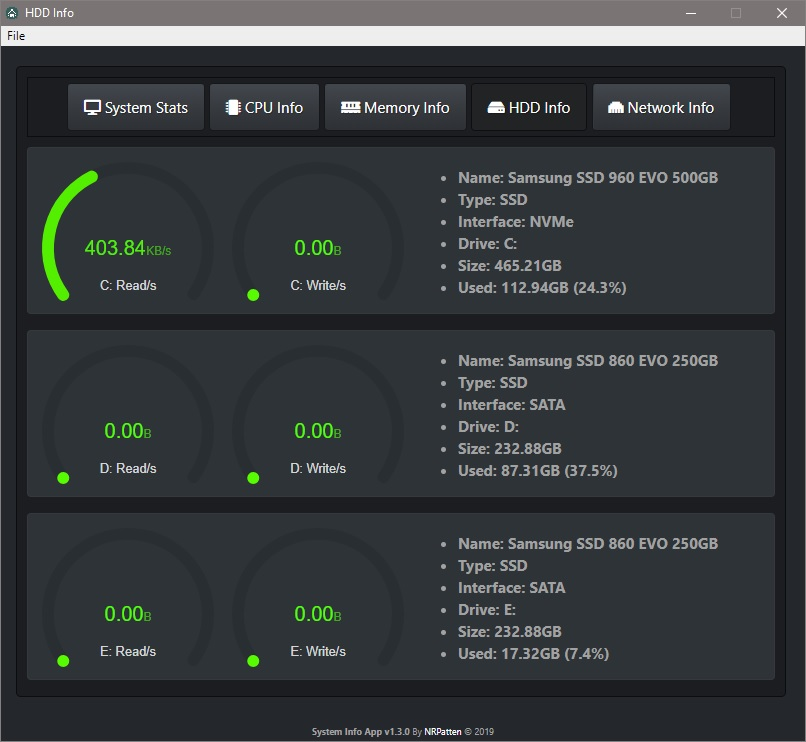
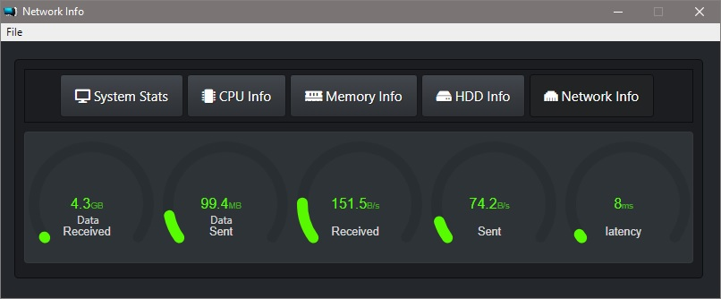

# SystemInfoApp
Electron System Info App v1.3.0

### Latest Auto Built Master Portable Version @ [This Link](https://gitlab.com/nrpatten/SysInfoApp/-/jobs/artifacts/master/download?job=builds)

### Latest Auto Built Original Portable Version @ [This Link](https://gitlab.com/nrpatten/SysInfoApp/-/jobs/artifacts/original/download?job=builds)

